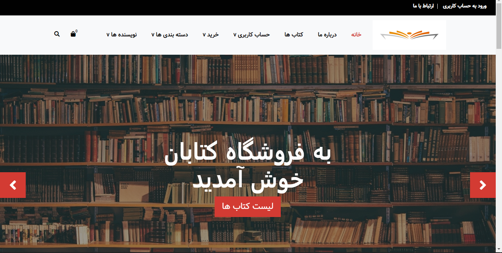
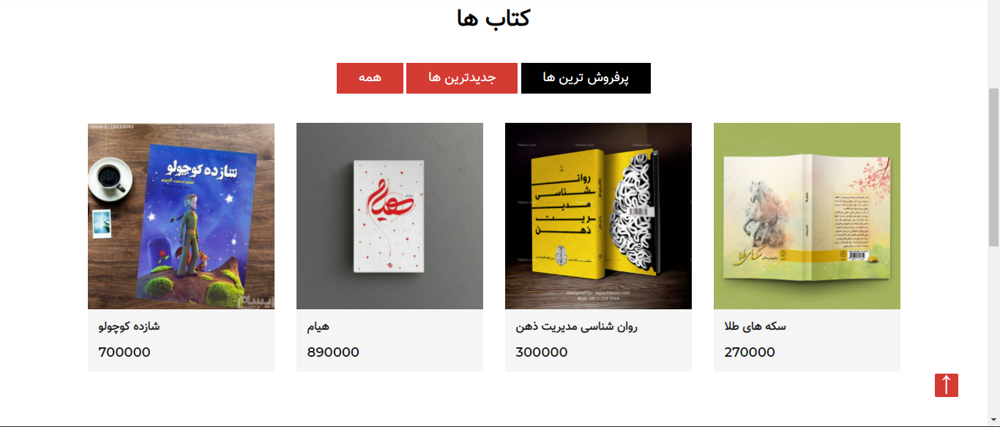
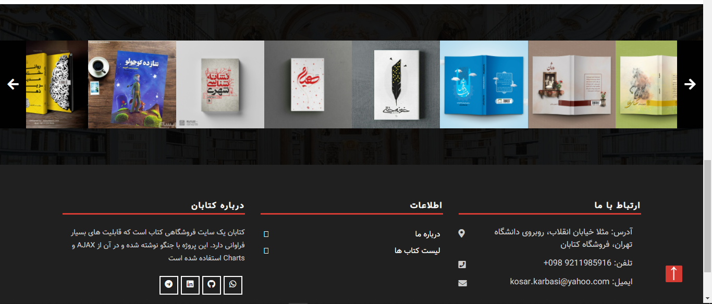
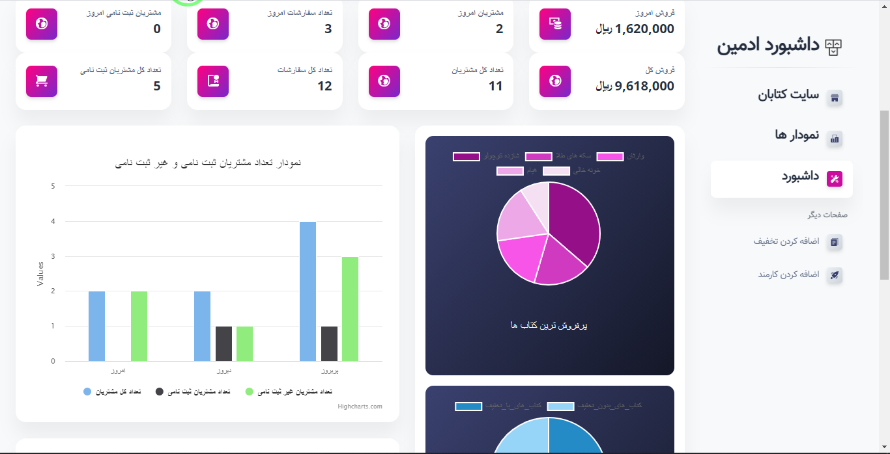

# BookStore Django web Application

## Features

This web application contains:

* login / logout
* forget password with receive email
* register with email confirmation
* change password
* any user can see products
* any user can add products to cart
* just login users can checkout
* every registered user has profile
* login users can edit their profile, add/delete/active addresses
* there are three type of users:
    * admin
    * personnel
    * admin

* admin:
    * has admin dashboard with useful reports and charts
    * can create personnel
    * can create book
    * can update book
    * can create code discount
    * can add category
    * can add author
    * can delete book
    * ...

* personnels can:
    * create book
    * create category
    * view books
    * delete book
    * update book

* customer can:
    * login/ logout/ register/ ...
    * add to cart
    * delete from cart
    * edit profile
    * define/ delete/ active address

There are 3 types of discount:

* code discount
* amount discount
* percent discount

It is possible to search in site base on name of books and authors

## Technologies
 * Python
 * Django
 * AJAX
 * JQuery
 * HTML
 * CSS
 * Bootstrap
 * Javascript

### Here are some pages of This Project

